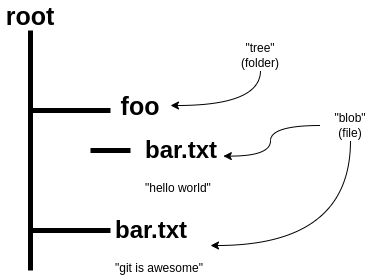
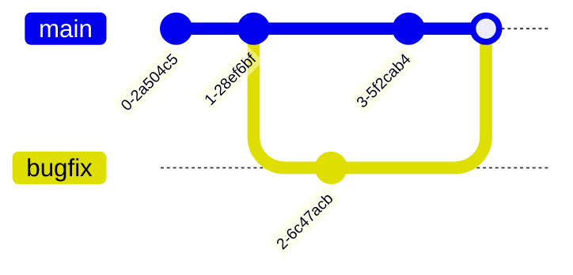
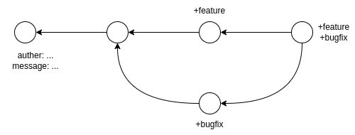

# 第6讲 版本控制（Git）

## 课堂笔记

版本控制（version control system），其是跟踪源代码或其他文件/文件夹的更改记录的工具。通过一系列快照跟踪记录文件的更改，所以可以“抓拍”到文件夹的某一时刻所有内容。除了在实际内容的修改记录之外还维护着一些元数据，为了便于识别一些信息（例如：谁更改了哪些信息或者某个更改是何时执行的等等）。

本讲并不会按照传统方式讲解git,而是对git的数据模型和内部实现细节进行讲解。通过理解git是如何操纵底层数据模型，你可以很快地理解git的命令是如何执行的。这样就是为什么不一开始就讲解git命令的原因。

	 

git模型

上述是文件/文件夹模型，git还包含一个历史模型，用于描述不同快照之间的关系。该历史模型通过有向无环图的方式实现：

例如上面例子：每一个圆圈表示一个快照，每个快照依赖于父节点（即其左边第一个节点）。抽象来看：

	

### git命令行操作

- git init，git仓库初始化
- git help，将子命令作为参数，然后提供有关该命令的帮助
- git status，查看当前仓库状态
- git add，将子参数所代表的文件加入暂存区（staging area）
  - git add -p，以交互方式暂存文件的片段
- git commit，执行快照
- git checkout，切换到指定快照位置（实际上会改变你当前的工作目录的内容，所以当前在修改某些内容时，checkout会销毁你的修改）
  - 如果checkout的参数为文件，则将会丢弃在工作目录中所做出的更改
  - git checkout -b xxx，创建xxx分支并跳转到该分支
- git diff 显示当前目录自上次快照以来发生什么变化
  - git diff --cached，显示暂存区的更改
- git branch，用于访问分支，仅运行该命令列出本地仓库存在的所有分支
  - git branch --set-upstream-to=origin/master，设置跟踪来自‘origin’的‘master’分支。设置本地分支的远程分支为origin/master，这样直接输入`git push`即可。
- git merge，合并分支
  - git merge --continue，当分支出现冲突，解决完冲突后，可以使用该命令告诉git已经完成手动解决冲突
- git remote，列出当前仓库所有远程仓库
- git push <remote> <local branch>:<remote branch>，推送
- git fetch，将远程仓库与本地仓库联系
- git pull，相当于是`git fetch`+`git merge`
- git clone，获取远程仓库的副本，并使用该副本来初始化本地仓库
  - git clone --shallow，将克隆最新的快照，以达到快速克隆的目的
- git config，对git进行配置
- git blame，可以确定谁编辑了文件的哪一行，修改特定行的相应提交
- git stash，将工作目录恢复到上一次提交的状态，之前作出的修改“暂时不管它”
  - git stash pop，恢复之前“藏”起来的修改
- git bisect，对历史提交进行二分查找，例如：你某次测试突然不能通过，但是你并不能确定是历史上哪一次快照出现了问题，你可以使用该命令进行自动化查找，该命令可以接受脚本，用于查看提交的是好是坏。
- .gitignore文件，忽略跟踪本地仓库下某些文件/文件夹