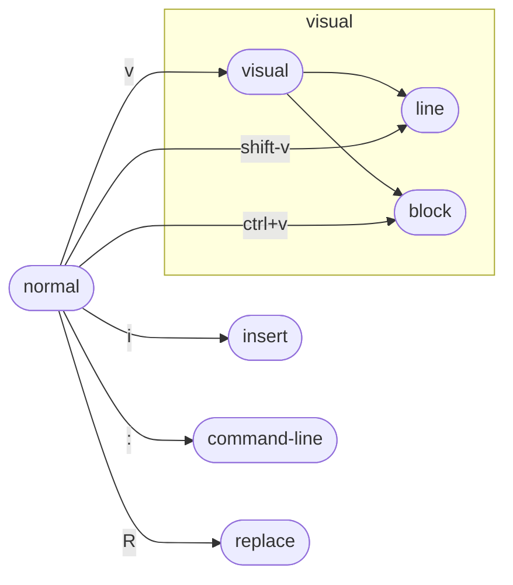

# 第3讲 编辑器（Vim）

## 课堂笔记

1. **vim不难入门，但需要一辈子去精通**
2. **vim本身就是一种基于命令的编程语言**

大部分时间都在normal模式和insert模式下。vim还有许多模式，覆盖模式（replace），可视模式（visual）等

> 其他所有模式都可以通过<ESC>键回到普通模式（normal）

“CTRL+V”三种写法：`^V`、`Ctrl+v`和`<C-V>`。

每个标签页（tab）有一些窗口（window），每个窗口对应一个缓冲区（buffer），一个缓冲区可以在零个或多个窗口中同时打开。

- `:q`并不完全是vim退出的命令，其本质上应该是关闭一个窗口命令。
- `hjkl` 光标的上下左右移动
- `w` 光标前进一个单词，word
- `b` 光标后退一个单词，beginning of word
- `e` 光标移动到单词末尾，end of word
- `0` 到行的开头，from Regex
- `$` 到行的末尾，from Regex
- `^` 到行第一个非空字符
- `ctrl+u` 向上滚动
- `ctrl+d` 向下滚动
- `G` 移动到文本最底部
- `gg` 移动到文本最顶部
- `L` 移动到屏幕上显示的最低行，Lowest
- `M` 移动到屏幕上显示的中间行，Middle
- `H` 移动到屏幕上显示的最顶行，Highest
- `f` 行内前进查找，find
- `F` 行内后退查找
- `t` 行内前进查找目标前一个字符，to
- `T` 行内后退查找目标后一个字符
- `o` 在光标下方新开一行，并进入插入模式
- `O` 在光标上方新开一行，并进入插入模式
- `d` 与其他按键组合，进行删除，delete
- `c` 与其他按键组合，进行删除并进入插入模式，change
- `dd` 删除光标所处行
- `cc` 删除光标所处行，并进入插入模式
- `x` 删除光标所处字符
- `r` 将接下来输入的字符替换光标所处字符，replace
- `u` 撤销之前命令，undo **undo会撤销你所做的最后一次更改**
- `Crtl-r` 重做之前命令，redo
- `y` 复制，yank
- `p` 粘贴，pasting

> 复制的文本会进入*粘贴缓冲区*（paste buffer），粘贴缓冲区是指一个特殊的内部缓存区域，它存储了最近复制或剪切的文本，可以在需要的时候将其粘贴到编辑器中

- `v` 进入可视模式
- `ctrl-v` 进入矩形可视模式
- `~` 反转大小写
- `/` 全局搜索
- `n` 前进查看已搜索字符（串）
- `N` 后退查看已搜索字符（串）
- `.` 重复执行前一个编辑命令，例如：当你在插入模式输入一些字符串时，使用`.`将会重复你输入的操作，产生新的之前输入的字符串，就像是复制并拷贝一样
- 计数形式，形如`jjjj`可以通过`4j`替代

修饰符可以稍微改变移动命令的含义，其中两个特别有用的修饰符是“a”和“i”，“a”代表“around”，“i”代表“inside”。

示例：

当我们想要对形如“[hello world]”的文本，将“[]”中内容删除时，我们既可以将光标移动到“hello”上，通过`2cw`方式删除，也可以通过`ci[`方式。

## 讲义笔记

编程与写文档最大的不同在于：编程会将大量时间花在阅读/编辑上，而不是写代码。这样的思路下，你会发现 MircoSoft Word 和Visual Studio Code有很大不同。vim对此的思路是采取多模态方式，对于插入文件和操作文字采取不同的模式。

vim是可编程的，其接口本身就是一个程序语言：键入操作（以及其助记名）是命令，同时这些命令是可以组合的。在这样的设计哲学下使得vim成为一个能够跟得上你思维速度的编辑器。

对上面的键入操作进行总结：

- 移动
    - > 多数情况下在正常模式下，使用移动命令在缓存中导航。在vim里面移动也被称为“名词”，因为它们指向文字块。
    - 基本移动：`hjkl`(左、下、上、右)
    - 词：`w` 下一个词、`b` 词头、`e` 词尾
    - 行：`0` 行首、`^` 第一个非空字符、`$` 行尾
    - 屏幕：`H` 屏幕顶部、`M` 屏幕中间、`L` 屏幕底部
    - 翻页：`ctrl-u` 上翻、`ctrl-d` 下翻
    - 文件：`gg` 跳转文件头、`G` 跳转文件尾
    - 行数：`:{行数}<CR>`，例如：`:99`
    - 查找：`f`、`t`、`F`、`T`，向前/向后在本行查找，`,`和`;`用于导航匹配
    - 搜索：`/{正则表达式}`，`n`和`N`用于导航匹配
- 选择
    - >
      > - 可视化：`v`
      > - 可视化：`V`
      > - 可视化块：`ctrl-v`
      >
      > 用来移动命令进行选中操作
- 编辑
    - > 通过编辑命令和移动命令组合完成。vim的编辑命令也被成为“动词”，因为动词可以施动于名词。
    - `i` 进入插入模式
    - `O/o` 在光标之上/之下插入行
    - `d{移动命令}` 删除
    - `c{移动命令}` 修改
    - `x` 删除字符
    - `s` 替换字符
    - 可视化模式+操作：选中文字，`d` 删除或`c` 改变
    - `u` 撤销，`ctrl-r` 重做
    - `y` 复制
    - `p` 粘贴
    - `~` 改变字符的大小写
- 计数
    - > 通过一个计数结合“名词”和“动词”，使得执行指令若干次。
    - `3j` 向下移动3行
    - `3p` 粘贴三次
-     - 
-     - 
-     - 修饰语可以稍微改变“名词”的意义。常用修饰语有`i`，表示内部和`a`表示周围。
    - `ci(` 改变当前`(`中的内容

vim可以由位于`$HOME/.vimrc`的文本配置文件进行配置。

往往我们想要更多的功能，这个时候就需要借助扩展插件，在网上大叫都建议你需要一个插件管理器，但是实际上vim内置的插件管理器已经足以应付很多事情了。

vim的进阶操作

- `:s` 替换
  > `%s/foo/bar/g`: 在整个文件中将`foo`全替换成 bar
  >
  > `%s/\[.*\](\(.*\))/\1/g`： 将有命名的`Markdown`链接替换成简单 URLs

---
课后练习

**第一道题**

> 题目：完成`vimtutor`。备注：它在一个[80x24](https://en.wikipedia.org/wiki/VT100)（80 列，24 行） 终端窗口看起来效果最好。

---

**第二道题**

> 题目：下载我们提供的`vimrc`，然后把它保存到`~/.vimrc`。 通读这个注释详细的文件 （用 Vim!）， 然后观察 Vim 在这个新设置下看起来和使用起来有哪些细微的区别。

出现了行号，同时当尝试使用“↑”、“↓”、“←”、“→”时，会提示你使用“h/j/k/l”键代替。

---

**第三道题**

> 题目：安装和配置一个插件： ctrlp.vim.
> 1. 用`mkdir -p ~/.vim/pack/vendor/start`创建插件文件夹
> 2. 下载这个插件：`cd ~/.vim/pack/vendor/start; git clone https://github.com/ctrlpvim/ctrlp.vim`
> 3. 阅读这个插件的[文档](https://github.com/ctrlpvim/ctrlp.vim/blob/master/readme.md)。尝试用`CtrlP`来在一个工程文件夹里定位一个文件，打开 Vim, 然后用 Vim 命令控制行开始`:CtrlP`.
> 4. 自定义 CtrlP：添加[configuration](https://github.com/ctrlpvim/ctrlp.vim/blob/master/readme.md#basic-options)到你的`~/.vimrc`来用按 Ctrl-P 打开 CtrlP

----

**第四道题**

> 题目：练习使用 Vim, 在你自己的机器上重做[演示](https://missing-semester-cn.github.io/2020/editors/#demo)。

----

**第五道题**

> 题目：下个月用 Vim 完成所有的文件编辑。每当不够高效的时候，或者你感觉 “一定有一个更好的方式”时， 尝试求助搜索引擎，很有可能有一个更好的方式。如果你遇到难题，可以来我们的答疑时间或者给我们发邮件。

----

**第六道题**

> 题目：在其他工具中设置 Vim 快捷键 （见上面的操作指南）

笔者在intellij产品上使用 vim，并设置有相关配置和插件

---

**第六道题**

> 题目：进一步自定义你的 ~/.vimrc 和安装更多插件。

----

**第七道题**

> 题目：（高阶）用 Vim 宏将 XML 转换到 JSON ([例子文件](https://missing-semester-cn.github.io/2020/files/example-data.xml))。尝试着先完全自己做，但是在你卡住的时候可以查看上面[宏](https://missing-semester-cn.github.io/2020/editors/#macros)章节。

详细步骤可以参考：[editors-solution](https://missing-semester-cn.github.io/missing-notes-and-solutions/2020/solutions/editors-solution/)